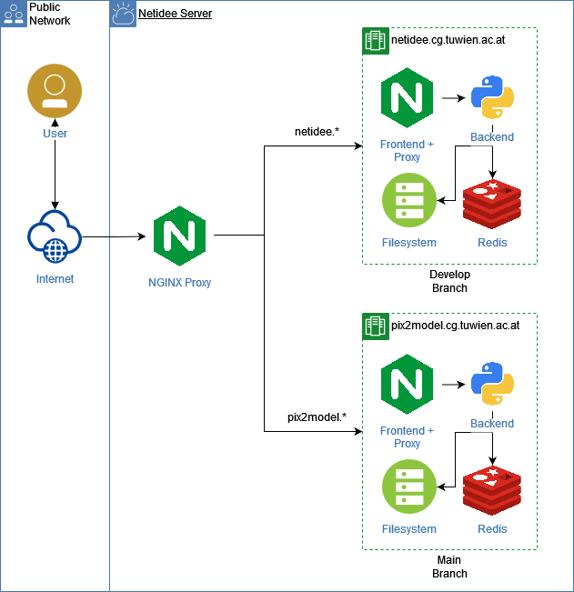

# Development Environment Setup

This guide is meant for people who plan to change this project and require frequent testing.
This is an extension to the basic [Setup](setup.md). Please make sure it runs correctly before adding these changes.
This is based on our current setup running at `https://netidee.cg.tuwien.ac.at/`.


## Continuous Integration (CI)

When we update the code in our repository, we want the server to update automatically. 
This is done using GitHub Actions. 
Since you don't have access to our GitHub Actions, you need to fork our repository and set up the Actions there.
If you didn't do this already, switch the server from our repository to your forked one. 
Don't forget to copy already changed data (e.g. the certificate and `.env` file) if necessary.

Modify the `.github/workflows/onPushAction.yml` so that it points to your server instead of ours.
The workflow is triggered whenever you push to the main branch of your repository. 
It connects to the server via SSH and executes the `deploy.sh` script. (TODO: re-structure and check in)

This script lets the server:
* kill all running docker containers using the `docker-compose.yml` file.
* pull from the main branch to make sure the local repository is on the current state.
* rebuild all docker images (client-deployed, backend, worker, dashboard, redis).
* start all docker containers in detached mode using `docker compose up -d`.

This also means that GitHub needs to connect to your server via SSH. 
If you don't yet have a key pair for the server user, impersonate them:
```bash 
sudo su -- netidee-server
```
and generate a new one with:
```bash 
ssh-keygen
```
On GitHub, in your repository settings -> Secrets and variables -> Actions, add a new repository secret `SSH_KEY` 
and enter the public key from your server's `~/.ssh/id_rsa.pub`.

Now you're ready to go. You can test the setup by pushing a commit (full test) or 
running the deploy script manually (server-side test):
```bash
cd /home/netidee-server/Server/
bash deploy.sh
```


## Develop Branch CI

We want to test new commits while keeping the production system untouched. 
Since we have limited resources, we can't afford a separate server for testing. But we have an older GPU. 
Since the bottleneck is mostly GPU compute power, we can keep the branches separate and 
keep the production branch is almost unaffected.

Therefore, we want to run the main branch on the strong GPU and the develop branch on the other one.
This means that we need separate GitHub Actions and the server must handle both branches.

The CI for the develop branch is specified in a separate workflow file: `.github/workflows/onPushActionDev.yml`.
Note that this file is only in the develop branch, corresponding to the `.github/workflows/onPushAction.yml`, 
which is only in the main branch. 
You need to change the same things as for the main branch.


### Proxy

To have one system handling both branches, we use an NGINX proxy. 
Using two different subdomains, namely *pix2model* and *netidee*, 
the proxy forwards the request to the corresponding docker compose container setup. 
From there, the internal proxy takes over hosting the web frontend and 
makes the backend accessible through the same ports. 

Here is an architecture overview:



A correct SSL setup requires that the certificates for both the production and development environments 
are mounted and configured in the outer proxy.


### Separate GPU Access

Our server has two dedicated GPUs that are assigned to the productive and development setups. 
Docker allows specifying the exact graphics card that a container is able to use. 
In the following example, the device IDs 0 and 3 are used for the *test* service:

```docker-compose
services:
  test:
    image: tensorflow/tensorflow:latest-gpu
    command: python -c "import tensorflow as tf;tf.test.gpu_device_name()"
    deploy:
      resources:
        reservations:
          devices:
          - driver: nvidia
            device_ids: ['0', '3']
            capabilities: [gpu]
```


