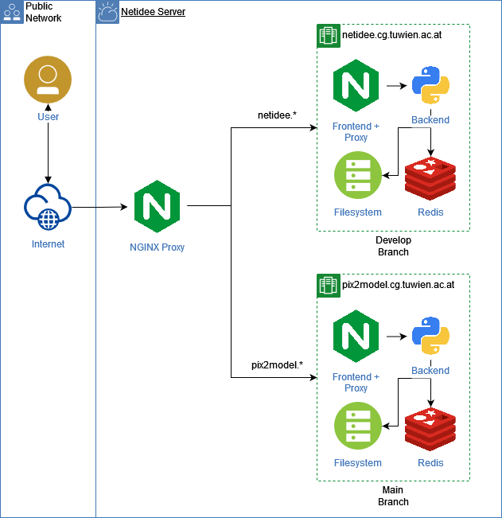

# Development Environment Setup - Pix2Model

## Setup

In order to have a separate development environment purely for testing purposes, we use a NGINX proxy. Using two different sub domains, namely *netidee* and *pix2model*, the proxy forwards the request to the corresponding docker compose container setup. From there, the internal proxy takes over hosting the web frontend and makes the backend accessible through the same ports. 

In order for a correct SSL setup, the certificates for both the production and development environments are mounted and configured in the outer proxy.

## CI

In addition, using Github Actions, we are able to redeploy each environment separately depending on whether changes are pushed on the *main* or *develop* branches.

## Docker GPU Capabilities

Our server has two dedicated GPUs that are assigned to the productive and development setups. Docker allows specifying the exact graphics card that a container is able to use. In the following example, the device IDs 0 and 3 are used for the *test* service:

```docker-compose
services:
  test:
    image: tensorflow/tensorflow:latest-gpu
    command: python -c "import tensorflow as tf;tf.test.gpu_device_name()"
    deploy:
      resources:
        reservations:
          devices:
          - driver: nvidia
            device_ids: ['0', '3']
            capabilities: [gpu]
```


## Architecture Overview


